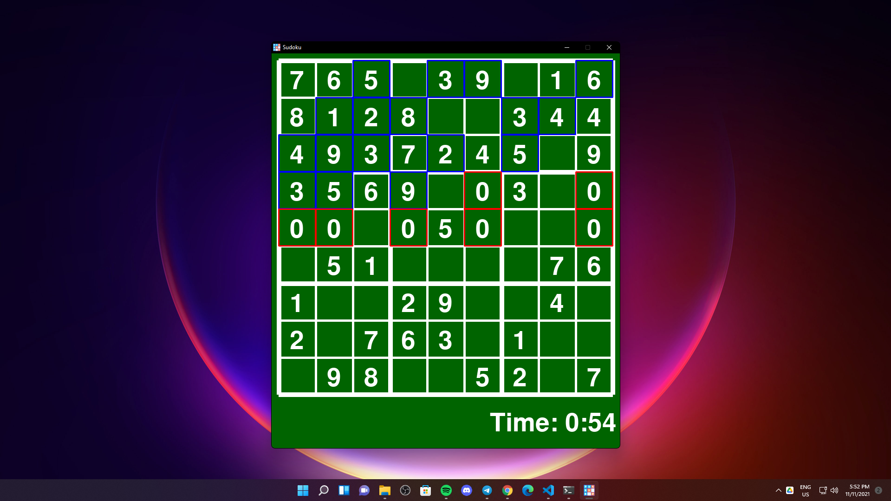
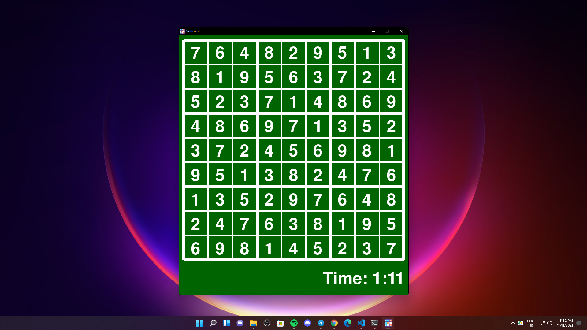

# Sudoku With PyGame and Backtracking Algorithm
Sudoku Game made with PyGame uses Backtracking Algorithm to solve the grid.

## GUI

## Controls
- Select cell by *MOUSE CLICK*.
- Insert number by pressing any of *NUMBERS KEYS* or *KEYPAD* (*NUMPAD*).
- Delete number by pressing *DEL*.
- Confirm insertion by pressing *ENTER*.
- Visualize solution by pressing *SPACE*.

## Backtracking Visualization

**Backtracking Algorithm**: 
A backtracking algorithm is a problem-solving algorithm that uses a brute force approach for finding the desired output.

- The Brute force approach tries out all the possible solutions and chooses the desired/best solutions.

The term backtracking suggests that if the current solution is not suitable, then backtrack and try other solutions. Thus, recursion is used in this approach.

This approach is used to solve problems that have multiple solutions. If you want an optimal solution, you must go for dynamic programming.
## Solution

