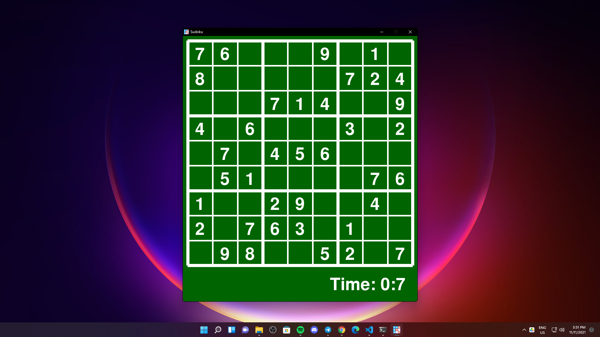
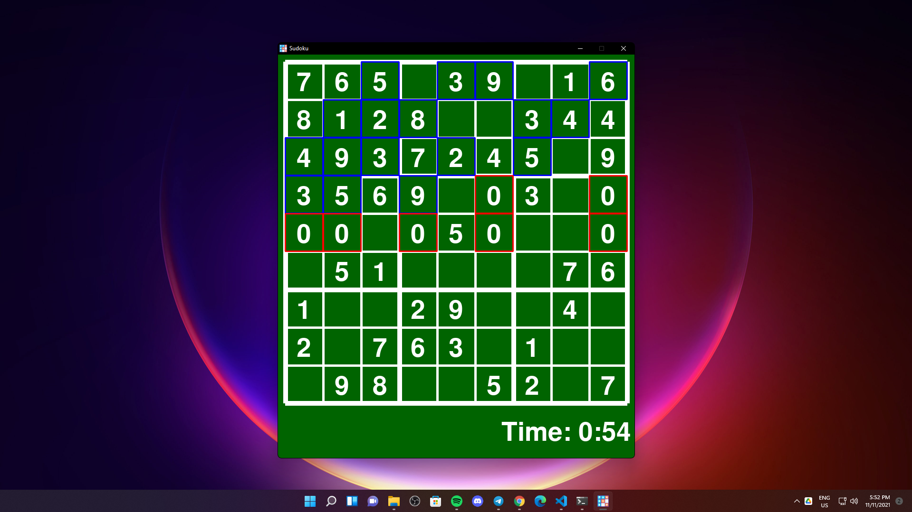
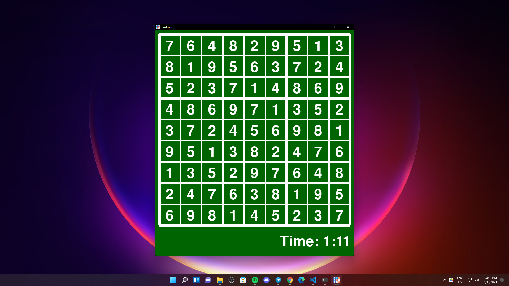

# Sudoku With PyGame and Backtracking Algorithm
Sudoku Game made with PyGame uses Backtracking Algorithm to solve the grid.

## GUI

## Controls
- Select cell by *MOUSE CLICK*.
- Insert number by pressing any of *NUMBERS KEYS* or *KEYPAD* (*NUMPAD*).
- Confirm selection by pressing *ENTER*.
- Visualize solution by pressing *SPACE*.

## Backtracking Visualization

## Solution

